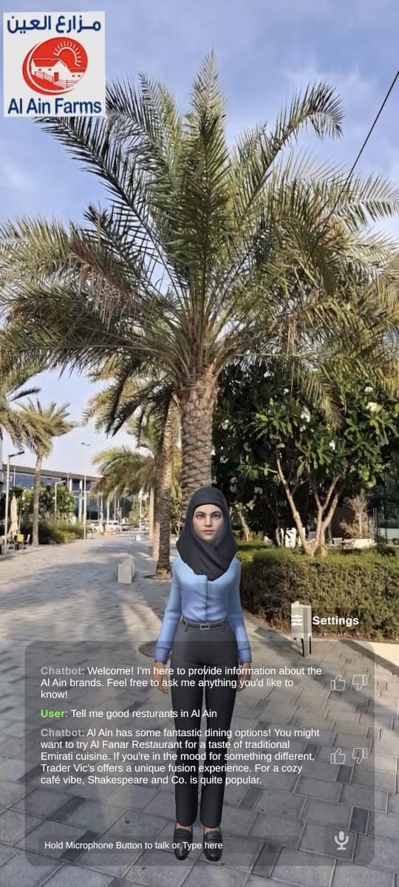

# AR Tourist Chatbot – Al Ain Guide

An **Augmented Reality (AR)** chatbot application built with **Unity** that serves as a personal AI-powered tourist guide for **Al Ain, UAE**. The chatbot has been trained on location-specific information and provides real-time, conversational responses to users’ questions, all within an immersive AR environment.

---

## Overview

This cross-platform app allows users to interact with a virtual tour guide in AR, simply by pointing their phone at their surroundings. Whether you're curious about Al Ain’s historic landmarks, cultural sites, or local tips, the AI chatbot provides accurate, engaging answers — making tourism more interactive and personal.

---

## Features

- **AI-Powered Conversations** using Convai
- **Trained on Al Ain-specific data** for accurate local guidance
- **Augmented Reality Experience** using Unity AR Foundation
- **Platform support**: Android (ARCore) 
- 3D virtual character responds in real-time with voice and gestures

---

## Tech Stack

- **Unity** (AR Foundation, C#)
- **Convai API** (for real-time conversational AI)
- **ARCore**

---

## 📸 Screenshots


  

---

## How to Run

1. **Clone the Repository**
   ```bash
   https://github.com/PaIakSharma/AR-Chatbot.git
2. Import Package into Unity
3. Follow steps in Convai documentary
   ```bash
   https://docs.convai.com/api-docs


